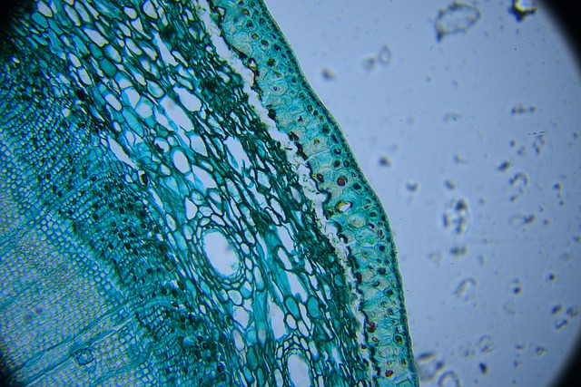

[About](#about) | [News](#news) | [Publications](#publications) | [Blog](#blog) | [Gallery](#gallery) | [Contact](#contact)

# Max Mustermann, MSc

 
 
 

## About me 
---
I am a predoctoral researcher at the [Institute of Environmental Systems Sciences](https://ess.uni-graz.at/en/) where I study critical transitions in nature and society. 

I am also part of the field of excellence Complexity of Life in Basic Research and Innovation [COLIBRI](https://colibri.uni-graz.at/en/) which investigates complex systems and prepares for future changes in the biosphere and sociosphere by understanding the complexity and interactions between components of living systems. 

[Uni Graz Profile](https://online.uni-graz.at/kfu_online/visitenkarte.show_vcard?pPersonenId=3647147652461D50&pPersonenGruppe=3) &emsp; [Github](https://github.com/spanadiel) &emsp; [Research Gate](https://www.researchgate.net/profile/Daniel-Reisinger-2) &emsp; [Google Scholar](https://scholar.google.com/citations?user=BM5QVbUAAAAJ&hl=en) &emsp; [Website](https://notblue.red/)

---
 
 
 

## 📰 News 
---
Save the date! From 11.11. - 13.11.2024, is this year's COLIBRI PhD Consortium Retreat. 

---
 
 
 

## 📚 Selected Publications 
---
### Critical transitions in degree mixed networks 
   **Reisinger D**, Adam R, Kogler ML, Füllsack M, Jäger G. Critical transitions in degree mixed networks: A discovery of forbidden tipping regions in networked spin systems. PloS One. 2022.
   
   [Link to publication](https://journals.plos.org/plosone/article?id=10.1371/journal.pone.0277347)

### Patterns of stability in complex contagions
   **Reisinger D**, Tschofenig F, Raven A, Kogler ML, Füllsack M, Veider F, Jäger G. Patterns of stability in complex contagions. Journal of Computational Social Science. 2024.
   
   [Link to publication](https://link.springer.com/article/10.1007/s42001-024-00294-3)

### Modular tipping points
   **Reisinger D**, Adam R, Tschofenig F, Füllsack M, Jäger G. Modular tipping points: How local network structure impacts critical transitions in networked spin systems. PloS One. 2023.
   
   [Link to publication](https://journals.plos.org/plosone/article?id=10.1371/journal.pone.0292935)

*For a full list of publications, please see my [Google Scholar Profile](https://scholar.google.com/citations?user=BM5QVbUAAAAJ&hl=en)* 

---
 
 
 

## 📝 Blog 
---
### Blogpost about Oranges
*Published on 11.11.2024*  
Oranges are not only a delicious and refreshing fruit but also packed with essential nutrients like vitamin C. In this post, we’ll explore the health benefits, history, and versatility of this vibrant citrus fruit.

[Link to full post](./blog/post-template.md)

### Blogpost about Apples
*Published on 12.11.2024*  
Apples have been a beloved fruit for centuries, with a rich variety of flavors and textures to suit every taste. Join us as we delve into the many ways apples enhance our diets and cultures around the world.

[Link to full post](./blog/post-template.md)

### Blogpost about Bananas
*Published on 13.11.2024*  
Bananas are a tropical favorite known for their natural sweetness and portability. Learn how this humble fruit provides vital energy, key nutrients, and surprising benefits to our health.

[Link to full post](./blog/post-template.md)

---
 
 
 

## 📷 Gallery 
*Images from the COLIBRI Retreat*

  
  

*Images from Picture Project*

  
  

 
 
 

## 📬 Contact Me 
Feel free to reach out!

Max Mustermann  
max.mustermann@uni-graz.at

Institute of Environmental Systems Sciences  
Merangasse 18, 8010 Graz  
Austria
